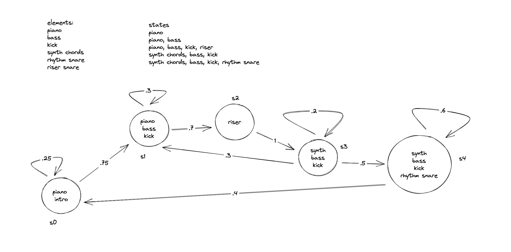

# Notes from Christine Tu

# Final Summary

## 1. "Alive" - Krewella
* Arrangement by me; the song is by Krewella
* [Link to repo](https://github.com/allolib-s23/demo1-christinetu15/blob/main/tutorials/synthesis/old_demos/demo2.cpp)
* Instructions to play: run ```./run.sh tutorials/synthesis/old_demos/demo2.cpp```
* This demo was really helpful in getting to explore and understand how the allolib repo/system worked. I used the playNote function that was demonstrated in class and was able to play around with the various sounds in the tutorials before settling on the Square Wave and Sine Wave classes from the tutorial sounds as well as the Kick and Hihat sounds from Mitchell's code (previous class repo). To create the piece, I abstracted the song into its various parts (melody, kick drum, bass, and hihat) and arranged the song by ear.

## 2. "Alive" - Krewella (modified with Markov chain for randomized music generation)
* Arrangement by me; the song is by Krewella
* [Link to repo](https://github.com/allolib-s23/demo1-christinetu15/blob/main/tutorials/synthesis/old_demos/demo-christine.cpp)
* Instructions to play: run ```./run.sh tutorials/synthesis/old_demos/demo-christine.cpp```
* In this demo, I built on my previous demo by adding a couple changes as well as adding in a randomized component. First, I wanted to clean up my previous demo's code which was clunky, repetitive, and generally not very DRY. For example, instead of hardcoding the time (and having to do quite a bit of mental math 😓), I took inspiration from Kaede's code and instead represented time in terms bars and measures which was incredibly helpful when it came to adding more notes. Next, I played around with the components of the song by converting it into a Markov chain-like structure with hardcoded probabilites between the states.  

## 3. "What Could Have Been" - Arcane Soundtrack (implemented with Musescore to json conversion)
* Transcription from Cappy63 on Musescore; the song is from the soundtrack of "Arcane". Also added some of my own melodies.
* [Link to repo](https://github.com/allolib-s23/demo1-christinetu15/blob/main/tutorials/synthesis/arcane.cpp)
* Instructions to play: run ```./run.sh tutorials/synthesis/arcane.cpp```
* In this demo, I wanted to find a better way to represent the song that wasn't repeatedly hard coding each note through calling the playNote function (which was not very DRY). I wanted to use JSON to represent the playNote function inputs and to be able to create music in a music notation program where I could simply drag and drop notes to where I wanted them to be (like Musescore). I found that after converting my Musescore piece to MIDI, I could convert the MIDI to JSON and use a C++ JSON interpreter to get the notes, along with all the associated information such as time, amplitude, and duration. In this way, I could use dynamics and staccato/legato without having to think about the explicit duration/amplitude of the note. For this piece, I chose the plucked string sound as I thought it lent a medieval atmosphere to the song, and a Square Wave sound for the melody as it had a haunting sort of sound. 



## 4. "Breath of the Wild Main Theme" - Legends of Zelda: Breath of the Wild Soundtrack
* Transcription from Scarred Wolf on Musescore; the song is from the soundtrack of the video game "Legends of Zelda: Breath of the Wild"
* [Link to repo](https://github.com/allolib-s23/demo1-christinetu15/blob/main/tutorials/synthesis/botw.cpp)
* Instructions to play: run ```./run.sh tutorials/synthesis/botw.cpp``` and press 'p' on your keyboard
* In this demo, I wanted to experiment with the sounds after reading in the notes from a transcription. From my previous demo, I noticed that the Square Wave sounded tinny (and kind of painful tbh) on the high notes so worked to limit the amplitude of the notes as well as avoiding the issue by moving particularly high notes down an octave. In addition, I incorporated some of the feedback from Andrew into making this piece sound nicer as well. 

## 5. Final Demo
